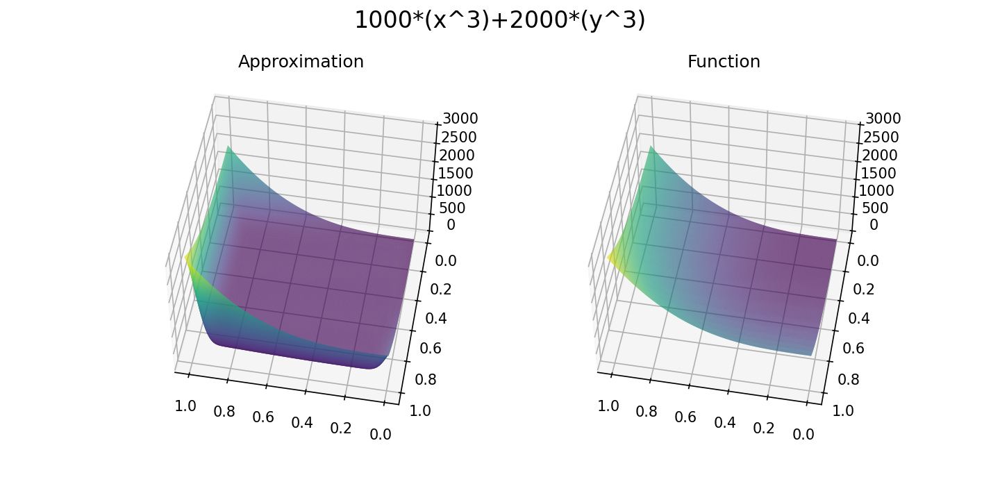
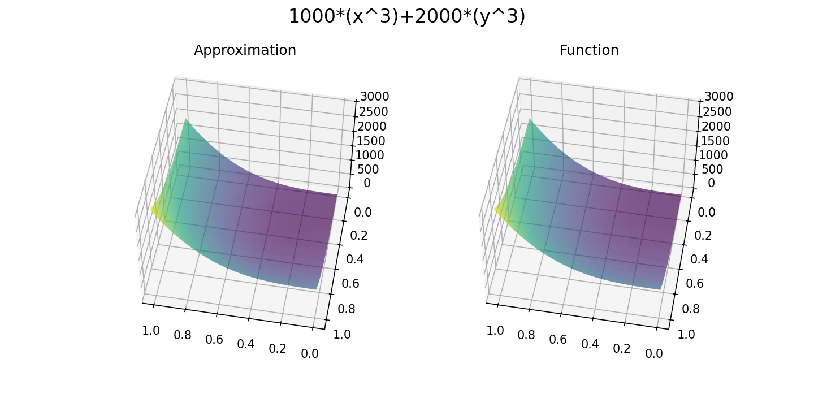

# Метод конечных разностей: 
Это одним из наиболее распространенных подходов численного решения
дифференциальных уравнений. Метод конечных разностей может быть спользован для численного решения задачи Дирихле (*для уравнения Пуассона*). 

>**Задача Пуассона оределяется следующим образом:**
>
>(Для простоты: $`f:R^2 -> R`$)
$`\begin{cases}
\dfrac{\delta^2u}{\delta x^2} + \dfrac{\delta^2u}{\delta y^2} = f(x, y), & \quad \text{$(x, y) \in D $}\\ 
u(x, y)=g(x,y)  & \quad \text{$(x, y) \in D^0 $}
\end{cases}`$
> * $`u := u(x, y)`$ - функция, которую надо найти
> * $`D`$ - область определения
> * $`D^0`$ - граница области $`D`$
> * $`f`$ и $`g`$ - функции, заданные при постановке задачи

>**Метод конечных разностей:**
>
>(Для простоты: $`D \subset [0,1]\times[0,1]`$)
>$`
D := \{(x_i, y_j):x_i=ih,y_j=jh, 0\leq i, j \leq N+1, h=1/(N+1)\}
\\
u_{ij} = 0.25*(u_{i-1,j} + u_{i+1, j} + u_{i,j-1} + u_{i,j+1} - h^2*f_{ij})
`$
> * функция $u$ во всех $`ij`$-ых точках приближается до тех пор (*метод итеративный*) пока 
>$`
\max_{0\leq i, j \leq N+1}(u_{ij}^k - u_{ij}^{k-1}) \leq \epsilon
`$
> * $`\epsilon`$ - задается
> * $`^k`$ - $`k`$-ая итерация

# Реализация: 
* Параллельная реализация алгоритма, основанного на этом методе, находится в файле `src/method.с`.
* Параллельные вычисления организованы с использованием библиотеки `OpenMP`.
* Поддерживается интерполяция функций:
  * $`D \subset [0,1]\times[0,1]`$
  * $`f:D -> R`$
* Инструменты для анализа эффективности алгоритма:
  * `scripts\generate_results.py` - позволяет визуализировать результаты интерполяции и вычислить отклонение от искомой функции
  * `scripts\summarize_results.py` - сохраняет результаты вычислений в единой таблице

# Тестирование

## Корректность
### $`1000*x^3 + 2000*y^3`$
#### Были проведены замеры отклонения полученного значения функции $u$ от эталонного значения. Использовался максимум абсолютной ошибки.

Результаты представлены в таблице:

<table border="1" class="dataframe">
  <thead>
    <tr style="text-align: right;">
      <th></th>
      <th>N</th>
      <th>eps</th>
      <th>max_err</th>
    </tr>
  </thead>
  <tbody>
    <tr>
      <th>1</th>
      <td>10</td>
      <td>0.010</td>
      <td>0.07</td>
    </tr>
    <tr>
      <th>4</th>
      <td>50</td>
      <td>0.010</td>
      <td>2.42</td>
    </tr>
    <tr>
      <th>7</th>
      <td>100</td>
      <td>0.010</td>
      <td>9.91</td>
    </tr>
    <tr>
      <th>10</th>
      <td>500</td>
      <td>0.010</td>
      <td>122.97</td>
    </tr>
    <tr>
      <th>13</th>
      <td>1000</td>
      <td>0.010</td>
      <td>555.43</td>
    </tr>
  </tbody>
</table>

Из таблицы видно, что с увеличением N при фиксированном $`\epsilon`$ точность интерполяции существенно снижается. 

Расширенная версия таблицы 

   <table border="1" class="dataframe">
  <thead>
    <tr style="text-align: right;">
      <th></th>
      <th>N</th>
      <th>eps</th>
      <th>max_err</th>
    </tr>
  </thead>
  <tbody>
    <tr>
      <th>0</th>
      <td>10</td>
      <td>0.001</td>
      <td>0.01</td>
    </tr>
    <tr>
      <th>1</th>
      <td>10</td>
      <td>0.010</td>
      <td>0.07</td>
    </tr>
    <tr>
      <th>2</th>
      <td>10</td>
      <td>0.100</td>
      <td>0.68</td>
    </tr>
    <tr>
      <th>3</th>
      <td>50</td>
      <td>0.001</td>
      <td>0.24</td>
    </tr>
    <tr>
      <th>4</th>
      <td>50</td>
      <td>0.010</td>
      <td>2.42</td>
    </tr>
    <tr>
      <th>5</th>
      <td>50</td>
      <td>0.100</td>
      <td>24.22</td>
    </tr>
    <tr>
      <th>6</th>
      <td>100</td>
      <td>0.001</td>
      <td>0.99</td>
    </tr>
    <tr>
      <th>7</th>
      <td>100</td>
      <td>0.010</td>
      <td>9.91</td>
    </tr>
    <tr>
      <th>8</th>
      <td>100</td>
      <td>0.100</td>
      <td>95.68</td>
    </tr>
    <tr>
      <th>9</th>
      <td>500</td>
      <td>0.001</td>
      <td>18.05</td>
    </tr>
    <tr>
      <th>10</th>
      <td>500</td>
      <td>0.010</td>
      <td>122.97</td>
    </tr>
    <tr>
      <th>11</th>
      <td>500</td>
      <td>0.100</td>
      <td>569.74</td>
    </tr>
    <tr>
      <th>12</th>
      <td>1000</td>
      <td>0.001</td>
      <td>98.50</td>
    </tr>
    <tr>
      <th>13</th>
      <td>1000</td>
      <td>0.010</td>
      <td>555.43</td>
    </tr>
    <tr>
      <th>14</th>
      <td>1000</td>
      <td>0.100</td>
      <td>1389.68</td>
    </tr>
  </tbody>
</table>

> Размер сетки $`1000`$; $`\epsilon = 0.5`$:
> 
> 
>
> Размер сетки $`1000`$; $`\epsilon = 0.001`$:
> 
> 

## Эффективность

> Время ($`t`$) вычисляется в секундах.
---

#### Были проведены эксперименты, котрые показывают, какими значениями лучше всего инициализировать $`u_{ij}^0`$.

Результаты представлены в таблице: 
<table border="1" class="dataframe">
  <thead>
    <tr style="text-align: right;">
      <th></th>
      <th>t</th>
      <th>iters</th>
      <th>max_err</th>
      <th>mes</th>
    </tr>
  </thead>
  <tbody>
    <tr>
      <th>0</th>
      <td>1.672819</td>
      <td>5105</td>
      <td>1266.76</td>
      <td>Заполнять D\D^0 max(u(D^0)) </td>
    </tr>
    <tr>
      <th>1</th>
      <td>1.672854</td>
      <td>4997</td>
      <td>557.98</td>
      <td>Заполнять D\D^0 average(u(D^0)) </td>
    </tr>
    <tr>
      <th>2</th>
      <td>1.756099</td>
      <td>5420</td>
      <td>644.92</td>
       <td>Заполнять D\D^0 рандомными числами из [0; average(u(D^0))]</td>
    </tr>
    <tr>
      <th>3</th>
      <td>1.930585</td>
      <td>5890</td>
      <td>742.28</td>
      <td>Заполнять D\D^0 рандомными числами из [0; const]</td>
    </tr>
    <tr>
      <th>4</th>
      <td>2.192899</td>
      <td>6810</td>
      <td>943.24</td>
      <td>Заполнить D\D^0 нулями</td>
    </tr>
  </tbody>
</table>

* $`N = 500`$
* $`\epsilon = 0.1`$
* $`bs = 64`$
* $`threads = 8`$

 Из таблицы видно, что самым оптимальным вариантом является заполнять средним арефметическим из $`u(D^0)`$. 

---
#### Стоит заметить, что функции с большими коэфициентами сходятся дольше (при фиксированном размере сетки и $`\epsilon`$):

<table border="1" class="dataframe">
  <thead>
    <tr style="text-align: right;">
      <th></th>
      <th>func</th>
      <th>N</th>
      <th>bs</th>
      <th>eps</th>
      <th>iters</th>
      <th>threads</th>
      <th>t</th>
    </tr>
  </thead>
  <tbody>
    <tr>
      <th>0</th>
      <td>sin(x)</td>
      <td>500</td>
      <td>64</td>
      <td>0.01</td>
      <td>35</td>
      <td>8</td>
      <td>0.013892</td>
    </tr>
    <tr>
      <th>1</th>
      <td>sin(x)</td>
      <td>500</td>
      <td>64</td>
      <td>0.01</td>
      <td>35</td>
      <td>12</td>
      <td>0.014172</td>
    </tr>
    <tr>
      <th>2</th>
      <td>sin(x)</td>
      <td>500</td>
      <td>64</td>
      <td>0.01</td>
      <td>35</td>
      <td>4</td>
      <td>0.017563</td>
    </tr>
    <tr>
      <th>3</th>
      <td>x+y</td>
      <td>500</td>
      <td>64</td>
      <td>0.01</td>
      <td>78</td>
      <td>12</td>
      <td>0.026573</td>
    </tr>
    <tr>
      <th>4</th>
      <td>x+y</td>
      <td>500</td>
      <td>64</td>
      <td>0.01</td>
      <td>78</td>
      <td>8</td>
      <td>0.026869</td>
    </tr>
    <tr>
      <th>5</th>
      <td>x+y</td>
      <td>500</td>
      <td>64</td>
      <td>0.01</td>
      <td>78</td>
      <td>4</td>
      <td>0.033467</td>
    </tr>
    <tr>
      <th>6</th>
      <td>sin(x)</td>
      <td>500</td>
      <td>64</td>
      <td>0.01</td>
      <td>35</td>
      <td>1</td>
      <td>0.037367</td>
    </tr>
    <tr>
      <th>7</th>
      <td>x+y</td>
      <td>500</td>
      <td>64</td>
      <td>0.01</td>
      <td>78</td>
      <td>1</td>
      <td>0.072791</td>
    </tr>
    <tr>
      <th>8</th>
      <td>1000*x^3+2000*y^3</td>
      <td>500</td>
      <td>64</td>
      <td>0.01</td>
      <td>21961</td>
      <td>8</td>
      <td>5.783670</td>
    </tr>
    <tr>
      <th>9</th>
      <td>1000*x^3+2000*y^3</td>
      <td>500</td>
      <td>64</td>
      <td>0.01</td>
      <td>21966</td>
      <td>12</td>
      <td>6.707144</td>
    </tr>
    <tr>
      <th>10</th>
      <td>1000*x^3+2000*y^3</td>
      <td>500</td>
      <td>64</td>
      <td>0.01</td>
      <td>22208</td>
      <td>4</td>
      <td>7.216642</td>
    </tr>
    <tr>
      <th>11</th>
      <td>1000*x^3+2000*y^3</td>
      <td>500</td>
      <td>64</td>
      <td>0.01</td>
      <td>22208</td>
      <td>1</td>
      <td>18.261300</td>
    </tr>
  </tbody>
</table>

---

#### Сравнение скорости сходимости $`1000*x^3 + 2000*y^3`$ при разном количестве потоков:

<table border="1" class="dataframe">
  <thead>
    <tr style="text-align: right;">
      <th colspan="3"></th>
      <th colspan="7" align="center">threads</th>
    </tr>
  </thead>
  <tbody>
    <tr>
      <th colspan="3" ></th>
      <td>1</td>
      <td>4</td>
      <td>8</td>
      <td>12</td>
    </tr>
    <tr>
      <th>1</th>
      <td>N</td>
      <td>eps</td>
      <th colspan="7" align="center">t</td>
    </tr>
    <tr>
      <th>2</th>
      <td>10</td>
      <td>0.01</td>
      <td>0.000025</td>
      <td>0.000072</td>
      <td>0.000075</td>
      <td>0.000106</td>
    </tr>
    <tr>
      <th>3</th>
      <td>50</td>
      <td>0.01</td>
      <td>0.011594</td>
      <td>0.013583</td>
      <td>0.013583</td>
      <td>0.021064</td>
    </tr>
    <tr>
      <th>4</th>
      <td>100</td>
      <td>0.01</td>
      <td>0.135682</td>
      <td>0.124075</td>
      <td>0.132377</td>
      <td>0.158944</td>
    </tr>
    <tr>
      <th>5</th>
      <td>500</td>
      <td>0.01</td>
      <td>18.261300</td>
      <td>7.216642</td>
      <td>5.783670</td>
      <td>6.707144</td>
    </tr>
    <tr>
      <th>6</th>
      <td>1000</td>
      <td>0.01</td>
      <td>174.081266</td>
      <td>57.259726</td>
      <td>39.919225</td>
      <td>37.873221</td>
    </tr>
  </tbody>
</table>
