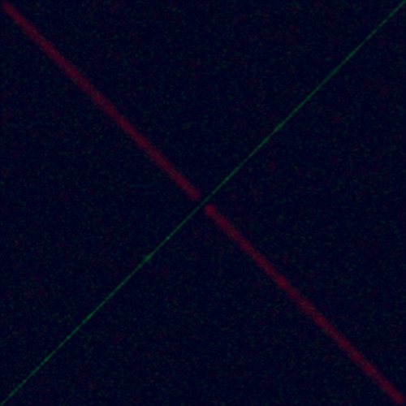

# SVD-Сжатие 24bit-BMP файлов

> Для сжатия была реализована CLI утилита, поддерживающая компрессию и декомпрессию.
> * Приведение к SVD может производиться тремя методами:
>  * [`numpy.linalg.svd(...)`](https://numpy.org/doc/stable/reference/generated/numpy.linalg.svd.html) - `numpy`
>  * [Степенной метод](https://www.jeremykun.com/2016/05/16/singular-value-decomposition-part-2-theorem-proof-algorithm/) - `power`
>  * [Блочный степенной метод](https://www.degruyter.com/document/doi/10.1515/jisys-2018-0034/html#j_jisys-2018-0034_fig_004) - `power-advanced`
> * Для хранения сжатого изображения используется [этот](WIKI.md) формат
---

# Сравнение реализованных методов

> Важно заметить, что все три метода работают разное время (`numpy` < `power` < `power-advanced`).
>
> Поэтому при постановке эксперимента `power` и `power-advanced` методы ограничивались по времени (работали не дольше
> чем `numpy`)

## Эксперимент

> Эмпирически обнаружено, что **в среднем** все методы работают приблизительно одинаковое (_особенно в условиях
неограниченного
времени_), однако здесь приведены именно граничные изображения, на которых заметна разница в работе приведенных
> алгоритмов.

Для начала рассмотрим черно-белое изображение, представленное в `24bit-BMP`:

* Коэффициентом сжатия `N = 8`
* Размер изображения `944 * 944` пикселей

| `Исходное`                 | `numpy`                      | `power`                      | `power-advanced`                      |
|----------------------------|------------------------------|------------------------------|---------------------------------------|
|  |  |  |  |

Разница практически не наблюдается, однако, если присмотреться, то `power` работает немного хуже двух других, так как
на картинке помимо размытых областей появляются пятна других цветов (отсутствующих на изначальной картинке)

Увеличим коэффициент сжатия до 10, чтоб цветовые пятна проявились ярче:

* Коэффициентом сжатия `N = 10`
* Размер изображения `944 * 944` пикселей

| `Исходное`                  | `numpy`                        | `power`                        | `power-advanced`                        |
|-----------------------------|--------------------------------|--------------------------------|-----------------------------------------|
|  |  |  |  |

Здесь различий уже больше, например, `power` метод сжал картинку так, что вершина горы стало синеватой. Остальные методы
между собой почти неразличимы.

Теперь рассмотрим изображение, состоящие только из трех цветов в формате `(red, green, blue)`:

* `(1, 1, 1)`
* `(255, 0, 0)`
* `(0, 255, 0)`

Со следующими параметрами:

* Коэффициентом сжатия `N = 2`
* Размер изображения `500 * 500` пикселей

| `Исходное`                      | `numpy`                           | `power`                           | `power-advanced`                           |
|---------------------------------|-----------------------------------|-----------------------------------|--------------------------------------------|
|  |  |  |  |

Здесь очевидно, что наилучшим образом отработал `numpy` метод, затем по качеству `power-advanced`, а `power` находится в
самом конце.

Любопытное продолжение последнего наблюдения

Разница заключается в том, что тут был добавлен синий круг в центр. Это привело к следующим интересным результатам:

* Ни один метод не исказил качество круга после сжатия
* `power` метод изменил цвет фона на более черный 
* Во всех методах между кругом и линиями появились черные пиксели

Параметры:

* Коэффициентом сжатия `N = 2`
* Размер изображения `500 * 500` пикселей

| `Исходное`                | `numpy`                     | `power`                     | `power-advanced`                     |
|---------------------------|-----------------------------|-----------------------------|--------------------------------------|
|  |  |  |  |

## Вывод

Таким образом можно сделать вывод о качестве используемых алгоритмов (_алгоритмы представлены в отсортированном порядке,
от лучшего к худшему_):

1. `numpy`
2. `power-advanced`
3. `power`
